---
language_tabs:
 - notes: Notes
 - javascript: Javascript
 - csharp: .NET
 
 
search: false
---

# Introduction

```notes
Use mustache.website to send your Email Marketing
and host your Landing Pages! 
```

[mustache.website](https://mustache.website) is a service you can use to manage your **Contact List**, execute your **Email Marketing** campaigns, send **Transactional Emails** and host your **Landing Pages**. By using state-of-the-art architecture, [mustache.website](https://mustache.website) delivers a professional tool at the minimum cost. 

You get the same, for less.

## Service Support

```notes
Do not hesitate to create a new issue
if you need help.
```

If you found an issue, please click [here](https://github.com/NachoColl/mustache.website.docs/issues) to open a new ticket or contact [me](https://www.linkedin.com/in/ignaciocoll/) on LinkedIn.


# Contacts List

To manage your contact list you can manually add contacts, import your Contacts from a [CSV file](https://en.wikipedia.org/wiki/Comma-separated_values) or use the available API to manage your contacts programmatically.


## Adding Contacts

```notes
Please note that the Email attribute is a key 
value that cannot be changed after creation. 

If you need to change a contact email, you must 
delete it and create a new contact.
```

To add a new contact, just select **My Contacts > Contact List** menu option and then click on the **New Contact** button. Enter the contact attributes and click on the Save button.

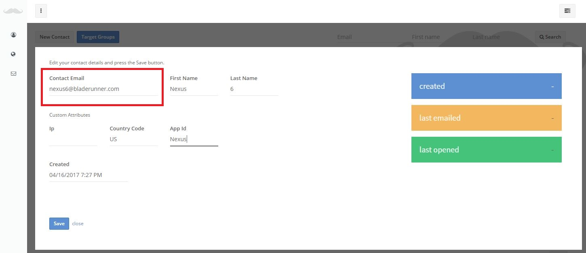


## Import Contacts

```notes
It's recommended that you initially 
try to import some small files with 
a few records to check the results.
```

Before you start, please check that your [CSV file](https://en.wikipedia.org/wiki/Comma-separated_values) follows the next rules:

- The first row contains the column names.
- There is an Email attribute column.
- Values are Numbers, Texts or Dates.
- Date columns use one of the allowed formats:
    * DD/MM/YYYY, e.g. 24/03/2017
    * MM/DD/YYYY, e.g. 01/25/2015
    * [Unix time](https://en.wikipedia.org/wiki/Unix_time) format (milliseconds), e.g. 1492364709813 representing Sun Apr 16 2017 19:45:09 GMT+0200.

<br/>

To start the import process click on **My Contacts > Import** menu option and select your CSV file. 

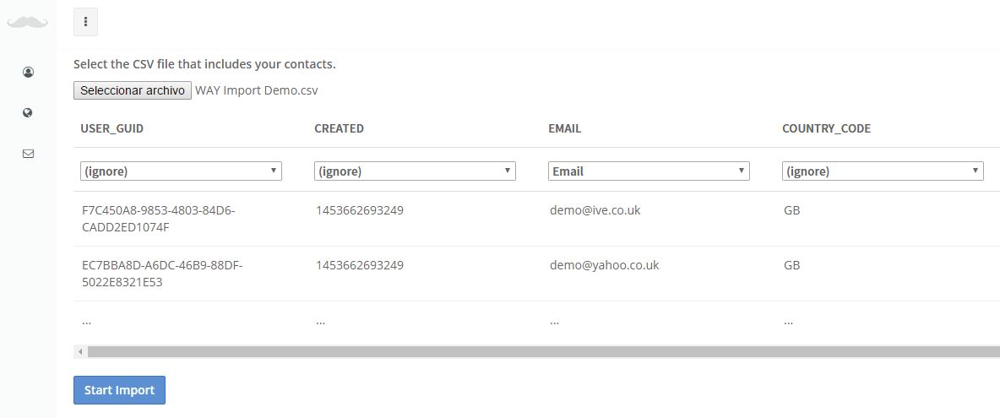

```notes
Double check your CSV file column mapping!
```

Take a look at the columns mapping that it's proposed and select the appropiate option for each column.

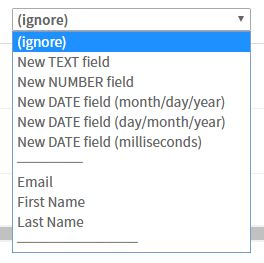

```notes
When you click the Start Import button, the 
CSV file is sent to the system and 
each row is then processed. 
```

Once you've finished mapping your CSV file columns, click on the **Start Import** button to start the import process.

```notes
You will get the import results on your 
account email, including the total
processed contacts and the total 
imported contacts number.

If there are errors while processing 
the file, you will also get some 
error details.
```

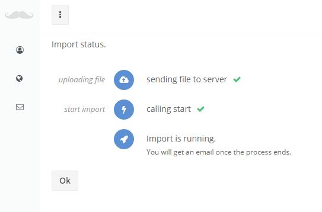


## Target Groups

```notes
If no new Target Groups are created, you're 
just going to be able to send a Campaign 
to all your contacts.
```

When you create a new Email Marketing campaign, you select the [Target Group](https://en.wikipedia.org/wiki/Target_audience) to which you want to send the message. That means that if you want to send your campaign to an specific group of contacts, you have to create a new Target Group that defines that group (e.g. Canada Users).

```notes
A Target Group is a database filter 
definition.
```
<br/>

To create a target group, go to **My Contacts > Contact List** and click on the **Target Groups** button.


```notes
Before saving a new Target Group, click on 
the Search button to test the filter.
```

Add the attributes values that define your target group, enter a Target Group name and click on the **Save as NEW target group** button.


# Email Campaigns

To create a new Email Campaign go to **Email Marketing > Campaigns** and click on **New Campaign** button. Enter a campaign name, select the Target Group you want to send the email message and click on the **Save** button.

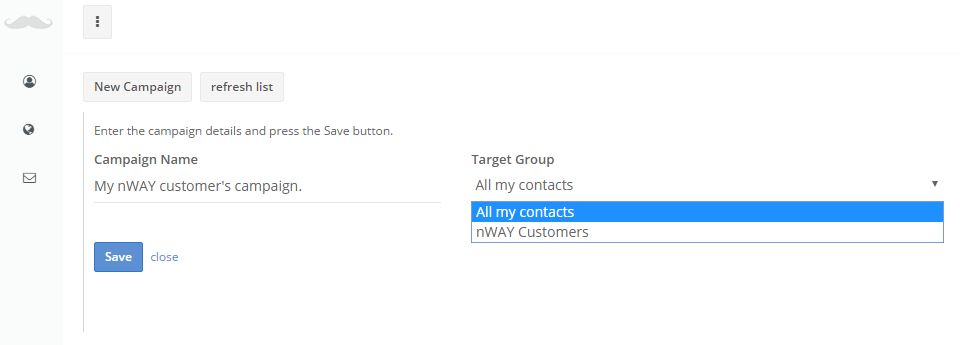


## Message Content

After you've set the campaign name and Target Group, click on the campaign **email content** button to setup the campaign email message. 

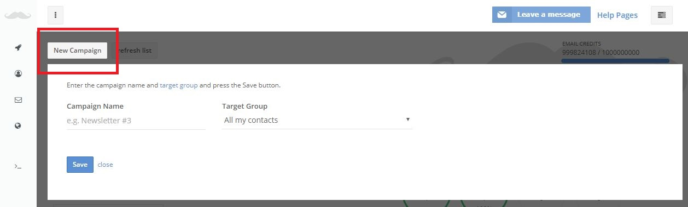

```notes
You can change the base template HTML code
when required to get the email message 
format you need.
```

The first time you click on the **email content** button you will get the option to select the base template you want to start building your campaign email. Check for the available templates and select the option that best fits your needs.

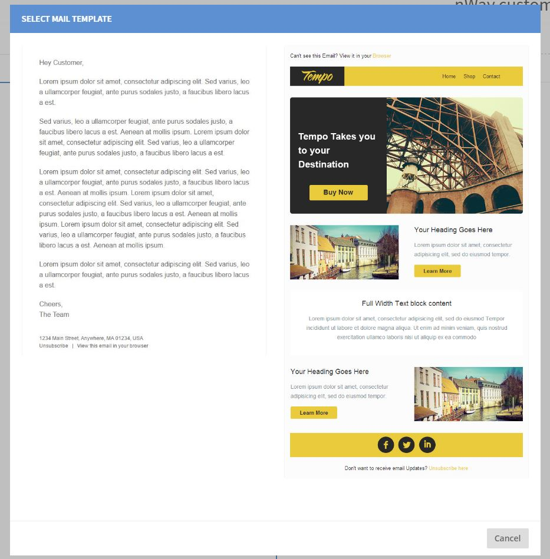

If you take a look at the next image, the content is defined by filling the text areas on the right, and not directly on the HTML preview.

```notes
mustache.website templates use the 
{{mustache}} technique so you can 
build your content by just filling 
a few textboxes.
```

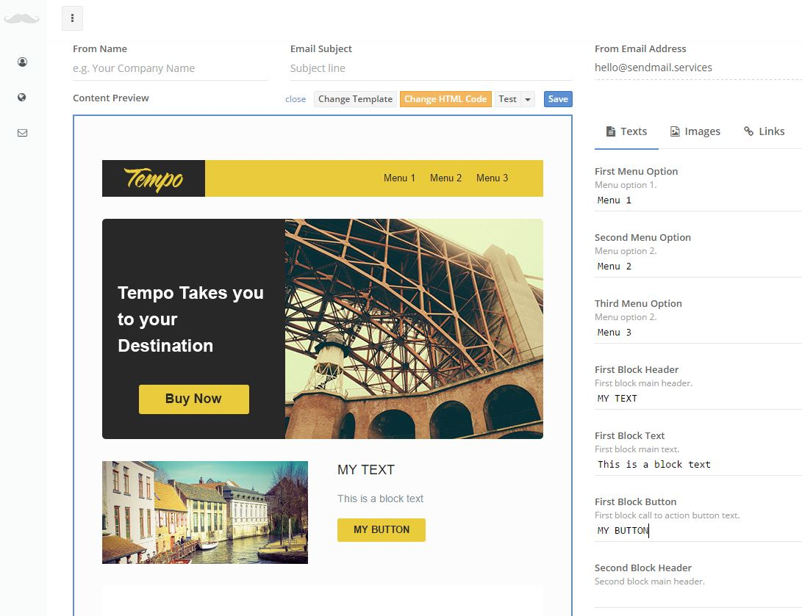

If the selected template needs some modifications to fit your needs, you can change the HTML code. Click on the **Change HTML Code** button, and an HTML editor will be displayed. Just take care that if you want to add a new mustache, you must use the correct format.

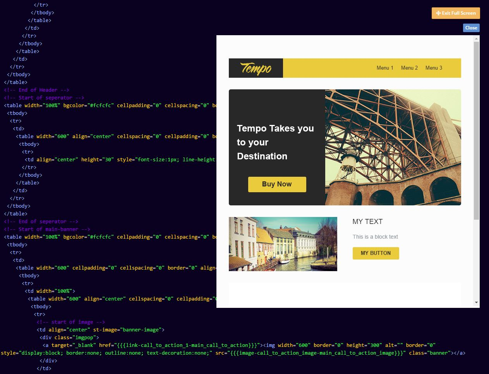


## Campaign Execution

Once your campaign is ready go to **Email Marketing > Campaigns** list and click on the **run the campaign** to start sending the email messages to your contacts. 

```notes
You can pause a campaign by just
selecting the Stop campaign option.
```

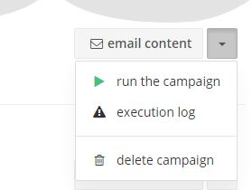

While running, you will get updates indicating the number of messages sent, delivered and the related bounces and complaints.


# Landing Pages

```notes
HTML pages are saved on AWS S3 bucket 
as static HTML pages. 

Please note that you can use your own domain(s)
to access your pages.
```

[mustache.website](https://mustache.website) landing pages are created by selecting an HTML template with some {{[mustaches](http://mustache.github.io/)}} that define the areas you can change. To create a new web page then you just need to select a template and fill the {{mustaches}}. 

There is no need to go through a new HTML design process every time!

## WEB Templates

> A WEB template example.

```notes

<!DOCTYPE html>
<html>

<head>
    <title>{{meta-page_title-the_page_title}}</title>
</head> 

<html>
<body>
    
    <h1>{{text-header_text-big_text}}</h1>
    
</body>
</html>
```

Before you can go for your landing pages you need to create at least one template. To start, select **Landing Pages > WEB Templates** menu option and click on the **New Template** button. 

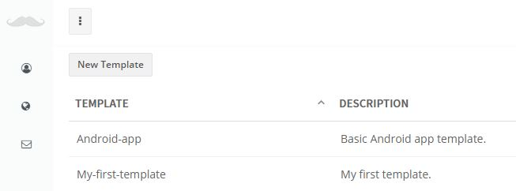

Check the available base templates you can start from, and click on the **Select** button for the selected template.

```notes
You can also start to code your template 
from scratch if required!
```

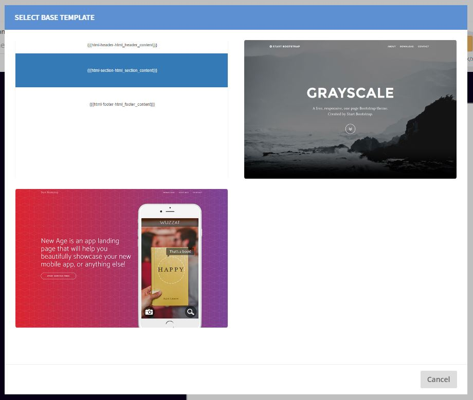


```notes

Just fill the 'mustaches', click save, and your 
landing page will be online!

```

Once selected, you will get an HTML editor so you can change the HTML. Just remember to use {{mustaches}} to the define the areas that will be required to modify when building the page later.

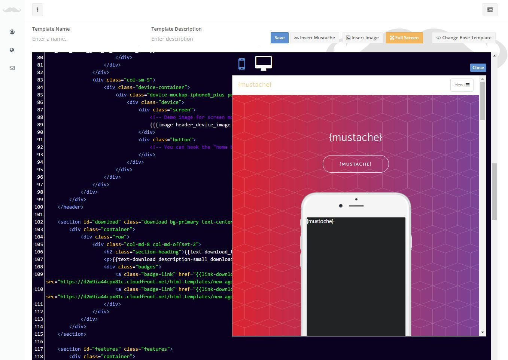
 
### Adding mustaches

To make things easy when building your landing pages, we added different types of mustaches that are coded as follows: 

``

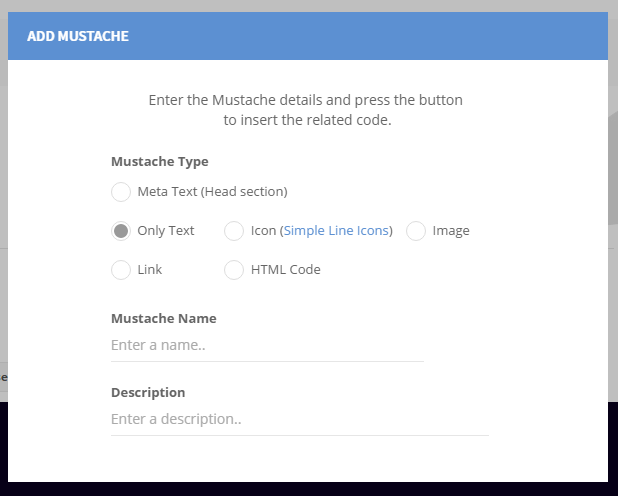

```notes
To insert a mustache in your HTML code, 
you must use the correct format.

We recommend that you use the Insert Mustache
button.

```

* **Meta** mustaches are used to set meta properties content.<br/> `{{{meta-page_title-the_page_title}}}`

* **Only Text** to include non-formatted text (format is already set on the template!).<br/> `{{{text-header_content-the_headear_title}}}`

* **Icon** so you can easely include a [Simple Icon](http://simplelineicons.com/) on your page. <br/> `{{{icon-feature-app_feature_icon}}}`

* **Image** to upload your images and use them when required. <br/> `{{{image-app_snapshot-product_snapshot}}}`

* **Link** to add references between your landing pages. <br/> `{{{link-download_link-the_app_download_link}}}`

* and **HTML** to add any extra HTML code your page may require. <br/> `{{{html-google-google_analytics_code}}}`

<br/>
By using those types, you get some extra help on page creation. For example, if you set an Icon mustache, you will get a button to select the icon from a list.

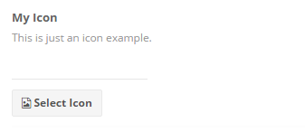


## Landing Page

```notes
Using WEB Templates you don't
have to do any design decision 
when building your pages.

```

To build and get online your landing page, click on **Landing Pages > My Pages** menu option and then click on the **New Landing Page** button. 

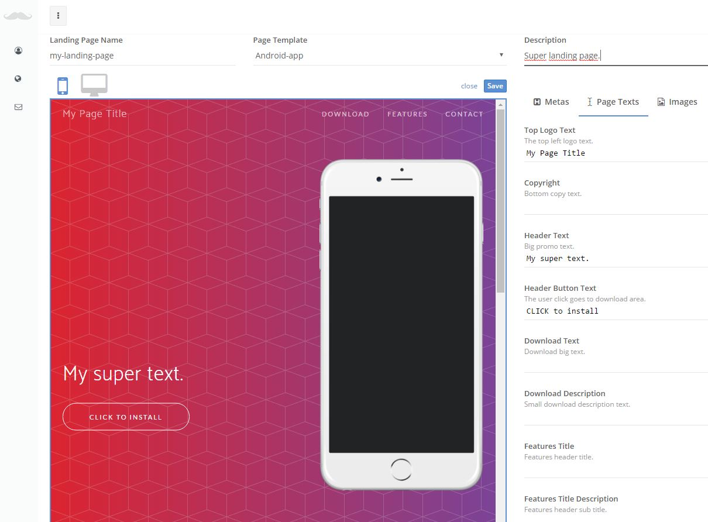

You will get a form to set a page name, a description and select the template you want to use. 

The key point is that when the template gets selected, all the related {{mustaches}} will get listed so you only have to fill the related boxes and save your work to get your page online.

```notes
When saved, the page will get visible 
on the Internet.
```

<aside class="warning">
IMPORTANT NOTE: once saved, the page name cannot be changed.
</aside>

```notes
If you change the template, all the 
previous values may be deleted.
```

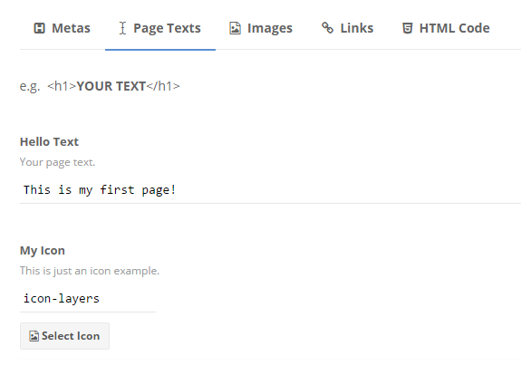

### Default URL

When your page gets saved, it's hosted on AWS S3 instantly. To check how it looks, just go to your page default address by clicking on the top page link.

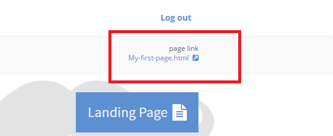

That link will look like `https://s3-us-west-2.amazonaws.com/files.landingpage.services/us-west-2:ca67230b-4f84-43bb-96d7-7fcbfdf1a034/My-first-page.html`, but of course you can use your own domain(s) if it's required.


### Use your domain(s)

```notes
A page can have multiple domains pointing to it!
```

To use your own domain create a new page as described above and click on the **Options*+ button.

<aside class="notice">
The Options button will only get displayed after saving your page.
</aside>

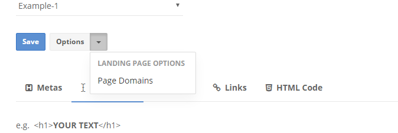

A popup will be displayed. Enter your domain (e.g. www.mydomain.com) and click on the **Add** button. Also remember to check the Default Page option if you want the current to get displayed as the default domain page.

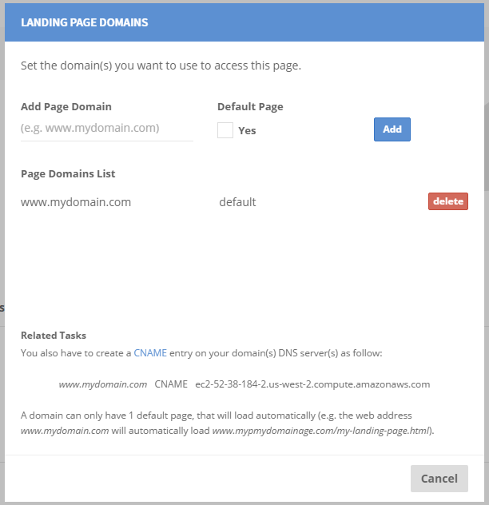

Please note that you also need to add a CNAME entry on your domain's DNS server.

`www.mydomain.com   CNAME   ec2-52-38-184-2.us-west-2.compute.amazonaws.com`


# API

You can use the Mustache API to:

- add new contacts (email receivers) programmatically,
- send transactional emails (emails not related with any campaign).


<aside class="notice">
To manage and execute your email marketing campaigns you must login at the website.
</aside>

If your coding using dotNET, you can install the available Nuget package:

`PM > Install-Package mustache.website.sdk.dotNET`

## API endpoint

To call mustache.website API methods, use **https://api.mustache.website** API endpoint .

For example, to create a new Contact, you call the metod `https://api.mustache.website/contact/add`


## Authentication

> Authentication example (select language on top)

```javascript
$.ajax({
    method: 'POST',
  	...
    headers: {
      'Content-Type': 'application/json',
      'X-Api-Key': 'my-api-key'
    },
   	...
  });
```

```csharp

 MustacheAPI API = new MustacheAPI("my-api-key");

```

**mustache.website** uses API keys to allow access to the API methods. You can get an API key at the [website](https://mustache.website).

We expect for the API key to be included in all API requests to the server in a header that looks like the following:

`'X-Api-Key': 'my-api-key'`

<aside class="notice">
You must replace <code>my-api-key</code> with your personal API key.
</aside>

## Passing parameters

Method call parameters must be passed in the Body part of the request message using [JSON](https://en.wikipedia.org/wiki/JSON) format.

The `Content-Type` header attribute must be set to `application/json`.

```

// How to set dates and numbers.

{
	
	...
	
	"date" : "1482932562"
	
	...
	
	"total" : 19.99
	
	...
	
	"countryCode" : "FR"
	
	...
	
}
```


### Dates Format

When setting dates, use [Unix time format](https://en.wikipedia.org/wiki/Unix_time). 

For example, `1482932562` date value translates to `Wednesday, 28-Dec-16 13:42:42 UTC`.

### Numbers Format

Numbers must use the dot "." symbol as the decimal mark (f.ex. 20.99). This is due to [JSON format](http://www.json.org/) requirements.

If you need to display a diferent format (f.ex. 20,99) please check Country Code parameter.

### Country Code

Country code (f.ex. `US`) is used to format currency and date values (and also to calculate some country related statistics). 

An example.

You may need to display date values using the French format (f.ex. 24/12/2017). In that case you must set `countryCode` to `FR` value.


## Send Email

<span style="color:green;font-size: 20px; font-weight: bold">mailing/email/send</span>

> Send email example 

```javascript
var sendEmailJson = {
    "from": { 
        "fromName" : "ACME Corporation", 
        "fromAddress" : "hello@acme.com"
        },
    "destination": {
        "toAddresses" : [ "customer1@mycontacts.com", "customer-info@mycontacts.com" ],
        "ccAddresses" : [ "customer-sales@mycontacts.com" ]       
    },
    "subject": {"data" : "Welcome to Acme!" },
    "body": 
      {
        "html": { "data": "<span style=\"color:blue\">Hello!</span>"} ,
        "text": { "data": "Hello!"}
      }
};

$.ajax({
    method: 'POST',
    url: 'https://api.mustache.website/mailing/email/send',
    data: JSON.stringify(sendEmailJson),
    headers: {
      'Content-Type': 'application/json',
      'X-Api-Key': 'ExV0d92KzQ8QgsTVnevddpbB8cUaAfPs7ntVF8g0'
    },
    dataType: 'json',
    success: function (response) {
      console.log(response); 
    },
    error: function (xhr, textStatus, errorThrown) {
      console.log(xhr);
    }
  });
```

```csharp
MustacheAPI API = new MustacheAPI(<YOUR_API_KEY>);

SendEmailResponse response = API.SendEmail(new Model.Email() {
    From = new FromEmailAddress(){
        FromName = "ACME CORPORATION",
        FromAddress = "hello@acme.com"
    },
    Destination = new DestinationEmailAddresses() {
        ToAddresses = new List<string>() {
            "ignacio.coll@gmail.com", "hello@mustache.website"
        }
    },
    Subject = new TextContent() { Data = "Just a test from API Call." },
    Body = new EmailBody(){
        Html = new TextContent() {
            Data = "This is an HTML formatted <span style=\"color:blue\">text</span>!"
        }
    }
});
```

Use this method to send an email.


### HTTP Request

`POST https://api.mustache.webservice/mailing/email/send`

### Request Parameters

Parameter | Type | Description 
--------- | -------  | ----------- 
from | [FromEmail] | set your name and reply to email address
destination | [DestinationEmailAddresses] | set destination addresses
subject | [TextContent] | subject description
body | [EmailBody] | email body content, including text and HTML format

---

#### FromEmail

Parameter | Type  | Description 
--------- | ------- | ----------- 
fromName | string | address name, (e.g. ACME Corporation)
fromAddress | string | email address (e.g. hello@acme.com) 


#### DestinationEmailAddresses

Parameter | Type  | Description 
--------- | ------- | ----------- 
toAddresses | list | list of destination addresses
ccAddresses | list | CC list of addresses
bccAddresses | list | BCC list of addresses

#### TextContent

Parameter | Type  | Default Value | Description 
--------- | ------- | ------- | ----------- 
charset | string | UTF-8 | sets the content character set
data | string | | the text content (e.g. Hello, this is a message)


#### EmailBody

Parameter | Type  | Description 
--------- | ------- | ----------- 
html | TextContent | HTML content
text | TextContent | non-formatted content


### Send Email Response Parameters

> Send email API response example 

```
{
    "statusCode": 200,
    "statusMessage": "",
    "info": {
        "remainingCredits": 995,
        "bounceRatio": 0.3,
        "complaintRatio" : 0.1
    }  
}
```

```csharp
SendEmailResponse response = API.SendEmail( ... );

switch(response.StatusCode){  
    case 200: // message sent.
        ...
        break;
    ...
}
```

When success (HTTP response code 200), you will get the next message in the body part as json text.

Parameter | Type  | Description 
--------- | ------- | ----------- 
statusCode | number | The call execution result (check [API Status Codes](#api-status-codes))
statusMessage | string | The result text message (e.g. error details)
info | [SendEmailResponseUserInfo] | Some user info

---

#### SendEmailResponseUserInfo

>Send Email response example when
using invalid recipient address.

```
{
    "info": {
    "remainingCredits": 999999823,
    "bounceRatio": 0,
    "complaintRatio": 0,
    "prohibitedAddresses": [
        "bounce+9999988@simulator.amazonses.com"
        ]
    },
    "statusCode": 403,
    "statusMessage": "No destination addresses after checking related contacts bounces and complaints."
}
```

Parameter | Type  | Description 
--------- | ------- | ----------- 
remainingCredits | Number | The remaining email credits
bounceRatio | Percentaje | Your current bounce ratio
complaintRatio | Percentaje | Your current complaint ratio
prohibitedAddresses | List of strings | The addresses deleted from the message


<aside class="warning">
Take care of the remaining credits and ratios before sending a new message.
</aside>


Please take note that `prohibitedAddresses` attribute indicates the addresses that have been deleted from the message before sending due to bounces and complaints. When a recipient address is not valid or user sends a complaint/spam warning, we mark the related email as not-valid for sending.

## Add Contact

<span style="color:green;font-size: 20px; font-weight: bold">contact/add</span>

> Add new contact example 

```javascript
var addContactJson = {
    "email": "hello@nachocoll.website",
    "firstName": "Nacho"
    "lastName": "Coll",
    "customAttributes": 
      {
        "attributeName" : "origin" ,
        "attributeType" : "S",
        "AttributeValue" : "mobile"
      }
};

$.ajax({
    method: 'POST',
    url: 'https://api.mustache.website/contact/add',
    data: JSON.stringify(addContactJson),
    headers: {
      'Content-Type': 'application/json',
      'X-Api-Key': 'ExV0432KzQ8QgsTVnevddpbB8cUaAfPs7ntVF8g0'
    },
    dataType: 'json',
    success: function (response) {
      console.log(response); 
    },
    error: function (xhr, textStatus, errorThrown) {
      console.log(xhr);
    }
  });
```

```csharp
MustacheAPI API = new MustacheAPI(<YOUR_API_KEY>);

AddContactResponse response = mustacheAPI.AddContact(new Contact()
{
    Email = "hello@nachocoll.website",
    FirstName = "Nacho",
    LastName = "Coll",
    CustomAttributes = new List<CustomAttribute>() {
        new CustomAttribute() {
            AttributeName = "origin",
            AttributeType = CustomAttribute.AttributeTypes.Text,
            AttributeValue = "mobile"
        }
    }
});
```

Use this method to add a new contact (email receiver) to your list.


### HTTP Request

`POST https://api.mustache.webservice/contact/add`

### Request Parameters

Parameter | Type | Description 
--------- | -------  | ----------- 
email | string | the new contact email address
firstName | string | contact first name [optional]
lastName | string | contact last name [optional]
customAttributes | list of [CustomAttribute] | contact attributes

---

#### CustomAttribute

Parameter | Type  | Description 
--------- | ------- | ----------- 
attributeName | string | the attribute name
attributeType | <span style="color:green; opacity:0.8">AttributeType</span> | one of available types
attributeValue | string | the attribute value 

where <span style="color:green; opacity:0.8">AttributeType</span> must be:

- `S` for text value,
- `N` for number, 
- `D1` for date formatted using day/month/year format,
- `D2` for date formatted using month/day/year format,
- `D3` for date using [Unix time](https://en.wikipedia.org/wiki/Unix_time) format (milliseconds).


Please note that attribute values will be converted to related attribute type. For example, if you set an attribute type `N` (number), and set a value like `'this is not a number'`, the API call will fail.

### Add Contact Response Parameters

> Add contact API response example 

```
{
    "statusCode": 200,
    "statusMessage": ""
}
```

```csharp
AddContactResponse response = API.SendEmail( ... );

switch(response.StatusCode){  
    case 200: // contact added.
        ...
        break;
    ...
}
```

When success (HTTP response code 200), you will get the next message in the body part as json text.

Parameter | Type  | Description 
--------- | ------- | ----------- 
statusCode | number | The call execution result (check [API Status Codes](#api-status-codes))
statusMessage | string | The result text message (e.g. error details)


## API Status Codes

The mustache.website API uses the following status codes:


Code | Meaning
---------- | -------
200 | The call was executed correctly
400 | Bad Request -- Check your request parameters
401 | Unauthorized -- Check your API key
403 | Forbidden -- Check your credits or bounce/complaint ratios
404 | Not Found -- Your API key is valid but there is no related user on our servers
405 | Method Not Allowed -- You tried to access with an invalid method
406 | Not Acceptable -- You requested a format that isn't json
409 | Conflict -- Check for already existing values (e.g. already existing Contact (email))
410 | Gone -- The requested object has been removed
418 | I'm a teapot
429 | Too Many Requests -- Slow down!
500 | Internal Server Error -- We had a problem with our server. Try again later
503 | Service Unavailable -- We're temporarially offline for maintanance. Please try again later


<br/><br/>

<span style="font-size:10px">This is THE END ;)</span>


