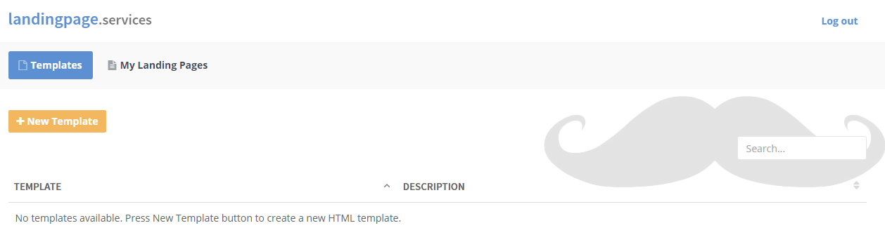
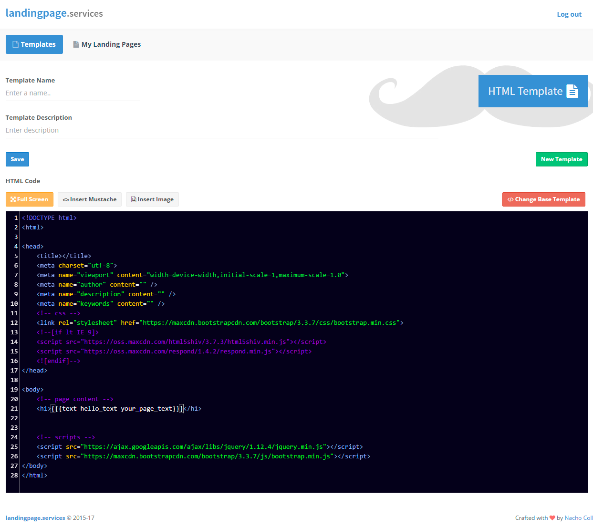
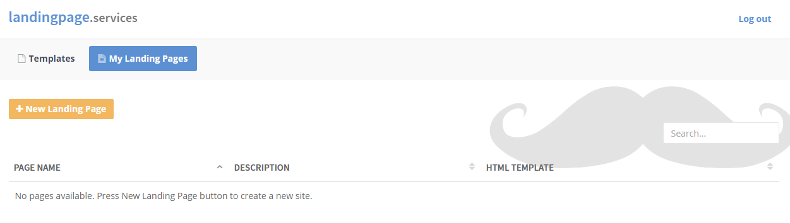

# Introduction

```notes
landingpage.services is a free service :)
```

Welcome to [landingpage.services](https://landingpage.services) help pages. 

A free tool you can use to create and host simple landing pages.

## How it works

```notes
HTML pages are saved on AWS S3 bucket 
as static HTML pages. 

Please note that you can use your own domain(s)
to access your pages.
```

A landing page is created by selecting an HTML template with some {{[mustaches](http://mustache.github.io/)}} that define the areas you can change when building a page. To create a new page then, you just need to select a template and fill the mustaches. 

There is no need to go through a new HTML design process every time!

# HTML Templates

> My first HTML template.

```notes

<!DOCTYPE html>
<html>

<head>
    <title>{{meta-page_title-the_page_title}}</title>
</head> 

<html>
<body>
    
    <h1>{{text-header_text-big_text}}</h1>
    
</body>
</html>
```

Before you can go for your landing pages you need to create at least one template. To start, just go to Templates menu option and click on the **New Template** button. 



On the new template form, enter a name and a description and take a look at the HTML code. A simple HTML template is proposed, with just a single mustache: `{{{text-hello_text-your_page_text}}}`. That means that using this initial template to build a new page, a simple text will be required to go.

```notes

When coding your template, external references 
(css files, scripts) must use a complete http path.

```




```notes

Just fill the 'mustaches', click save, and your 
landing page will be online!

```
Adapt or change the HTML you require for your template, and remember to use {{mustaches}} to the define the areas that will be required to modify when building the page.

 
## Adding mustaches

[landingpage.services](https://landingpage.services) works by using HTML {{[mustaches](http://mustache.github.io/)}} templates to define the variable content. To make things easy when writing the content, we added different types of mustaches that are coded as follows: `{{<meta|text|icon|image|link|html>-<name>-<description>}`.


```notes
To insert a mustache in your HTML code, 
you must use the correct format.

We recommend that you use the Insert Mustache
button.

```

* **Meta** mustaches are used to set meta properties content.<br/> `{{{meta-page_title-the_page_title}}}`

* **Only Text** to include non-formatted text (format is already set on the template!).<br/> `{{{text-header_content-the_headear_title}}}`

* **Icon** so you can easely include a [Simple Icon](http://simplelineicons.com/) on your page. <br/> `{{{icon-feature-app_feature_icon}}}`

* **Image** to upload your images and use them when required. <br/> `{{{image-app_snapshot-product_snapshot}}}`

* **Link** to add references between your landing pages. <br/> `{{{link-download_link-the_app_download_link}}}`

* and **HTML** to add any extra HTML code your page may require. <br/> `{{{html-google-google_analytics_code}}}`

<br/>
By using those types, you get some extra help on page creation. For example, if you set an Icon mustache, you will get a button to select the icon from a list.


# Landing Pages

```notes
We made that tool so you don't
have to do any design decision when building
your pages.

```

To build and get online your landing page, click on My Landing Pages menu option and then on the **New Landing Page** button. 



You will get a form to set a page name, a description and select the template you want to use. 

The key point is taht when the template gets selected, all the related {{mustaches}} will get listed so you only have to fill the related boxes and save your work to get your page online.

```notes
When saved, the page will get visible 
on the Internet.
```

<aside class="warning">
IMPORTANT NOTE: once saved, the page name cannot be changed.
</aside>

```notes
If you change the template, all the previous values may be deleted.
your pages.
```


## Default URL

When your page gets saved, it's hosted on AWS S3 instantly. To check how it looks, just go to your page default address by clicking on the top page link.


That link will look like `https://s3-us-west-2.amazonaws.com/files.landingpage.services/us-west-2:ca67230b-4f84-43bb-96d7-7fcbfdf1a034/My-first-page.html`, but of course you can use your own domain(s) if it's required.


## Use your domain(s)

```notes
A page can have multiple domains pointing to it!
```

To use your own domain create a new page as described above and click on the **Options*+ button.

<aside class="notice">
The Options button will only get displayed after saving your page.
</aside>


A popup will be displayed. Enter your domain (e.g. www.mydomain.com) and click on the **Add** button. Also remember to check the Default Page option if you want the current to get displayed as the default domain page.


Please note that you also need to add a CNAME entry on your domain's DNS server.

`www.mydomain.com   CNAME   ec2-52-38-184-2.us-west-2.compute.amazonaws.com`

<br/><br/>

<span style="font-size:10px">This is THE END ;)</span>


